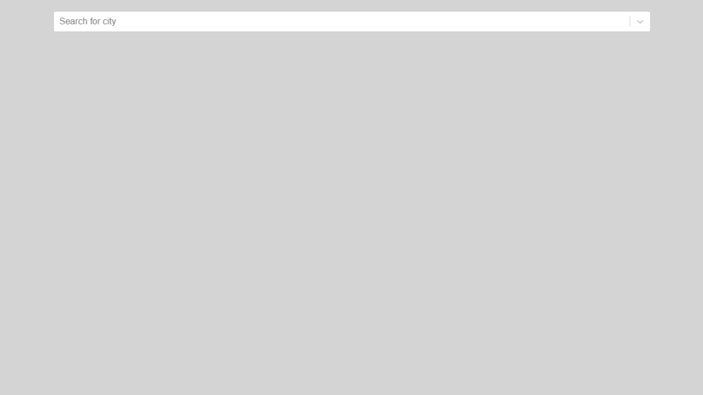
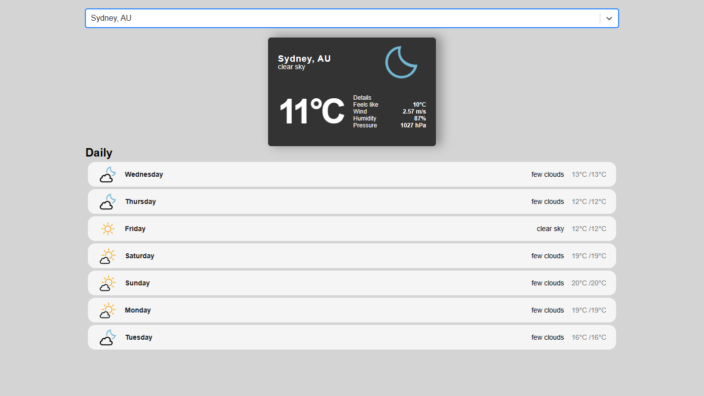

# Weather React App

## Description

This is a single-page web application for searching city-based weather forecasts built using [React](https://react.dev/). 

It allows users to type in a city into the search bar which prompts the display of a dynamically updated list of all results relative to the specified city. This project was completed with the aim of becoming familiar with using React to make API calls. 

## Installation

- Fork this repository
- Clone your forked repository
- Open your forked repository on your local computer in your preferred Text Editor
- In the project directory, run `npm start` in the terminal. 

This runs the app in the development mode.\
Open [http://localhost:3000](http://localhost:3000) to view it in your browser.

## Usage

- Type a keyword into the search bar (for example: "Sydney").
- Hover over any of the results to view its release date. 

## Screenshots

<b>Default state</b>

<b>Results for Sydney, Australia</b>

## Credits

- This project was completed as practice in accordance with guidance provided by a 96-minute [YouTube tutorial](https://youtu.be/Reny0cTTv24) uploaded by [freeCodeCamp.org](https://www.youtube.com/@freecodecamp) on the 14th of July 2022, titled “React JS Tutorial – Build a Weather App With Cities Autocomplete”.
- The styling used in this project was sourced from [Slobodan Gajic's React Weather App Github repository](https://github.com/bobangajicsm/react-weather-app).
- The API used in this project was sourced from [OpenWeatherMap API](https://openweathermap.org/api).
- This project was bootstrapped with [Create React App](https://github.com/facebook/create-react-app).

